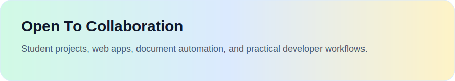
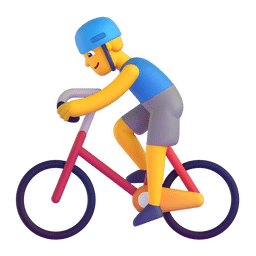

<div align="center">

[;Heidanr+builds+useful+things+step+by+step;USM+computer+science+student;Web+apps%2C+automation%2C+Markdown+workflows&center=true&size=27)](https://git.io/typing-svg)

<picture>
  <source media="(prefers-color-scheme: dark)" srcset="./assets/images/coding.gif" />
  <source media="(prefers-color-scheme: light)" srcset="./assets/images/developer.svg" />
  
</picture>

<div>&nbsp;</div>

<div>
  <a href="https://github.com/Flashhhhhhzj"></a>&emsp;
  <a href="https://www.linkedin.com/in/Flashhhhhhzj/"></a>&emsp;
  <a href="https://instagram.com/zzzzjun_0328"></a>&emsp;
  <a href="mailto:zhangjun@student.usm.my"></a>&emsp;
  
</div>

<picture>
  <source media="(prefers-color-scheme: dark)" srcset="https://cdn.jsdelivr.net/gh/Flashhhhhhzj/Flashhhhhhzj/profile-snake-contrib/github-contribution-grid-snake-dark.svg" />
  <source media="(prefers-color-scheme: light)" srcset="https://cdn.jsdelivr.net/gh/Flashhhhhhzj/Flashhhhhhzj/profile-snake-contrib/github-contribution-grid-snake.svg" />
  
</picture>



<div align="center">
  <a href="mailto:zhangjun@student.usm.my" target="_blank">
    
  </a>
</div>
</div>

# 🙋 Hello

<table>
<tr><td>

### 🤺 About Me


<p>&emsp;&emsp;嗨，你好，我是 Heidanr，目前在 USM 学习 Computer Science。</p>
<p>&emsp;&emsp;我喜欢把课程项目、开发工具、文档流程和 AI 工作流，慢慢打磨成真正能落地的小产品。</p>
<p>&emsp;&emsp;最近我更关注自动化、Markdown 管线、知识整理，以及把重复劳动变成稳定流程。</p>
<p>&emsp;&emsp;<strong>I like building practical systems that feel clean, useful, and reusable.</strong></p>

</td></tr>

<tr><td>

### 📃 Recent Feed


<!-- feed start -->
- Apr 02 - Building this profile README into a full showcase inspired by the reference project
- Apr 01 - Working on Feishu to Markdown content automation flows
- Mar 30 - Improving GitHub profile presentation and project discoverability
- Mar 28 - Iterating on student projects with cleaner documentation and tooling
- Mar 25 - Exploring LLM-assisted knowledge processing and structured import workflows
<!-- feed end -->

</td></tr>

<tr><td>

### 📊 WakaTime

<!--START_SECTION:waka-->
```text
Time tracking will appear here after WAKATIME_API_KEY is configured.

🕑 Time Zone: Asia/Shanghai
💬 Languages: waiting for first sync
🔥 Editors: waiting for first sync
💻 Operating System: waiting for first sync
```
<!--END_SECTION:waka-->

</td></tr>
</table>


<div align="center">


<div>
  <picture>
    <source media="(prefers-color-scheme: dark)" srcset="https://readme-jokes.vercel.app/api?hideBorder&bgColor=%23ffffff" />
    <source media="(prefers-color-scheme: light)" srcset="https://readme-jokes.vercel.app/api?hideBorder&bgColor=%23ffffff" />
    
  </picture>
</div>


<table>
  <tr>
    <td>
      <picture>
        <source media="(prefers-color-scheme: dark)" srcset="https://github-readme-activity-graph.vercel.app/graph?username=Flashhhhhhzj&theme=xcode&bg_color=FFFFFF&color=2563eb&line=14b8a6&point=f59e0b&area=true&hide_border=true" />
        <source media="(prefers-color-scheme: light)" srcset="https://github-readme-activity-graph.vercel.app/graph?username=Flashhhhhhzj&theme=xcode&bg_color=FFFFFF&color=2563eb&line=14b8a6&point=f59e0b&area=true&hide_border=true" />
        
      </picture>
    </td>
  </tr>
</table>

</div>


<div align="center">



<div><br/></div>

<table>
  <tr>
    <td></td>
  </tr>
</table>

<table>
  <tr>
    <td></td>
    <td></td>
  </tr>
  <tr>
    <td></td>
    <td></td>
  </tr>
  <tr>
    <td></td>
    <td></td>
  </tr>
  <tr>
    <td></td>
    <td></td>
  </tr>
  <tr>
    <td></td>
    <td></td>
  </tr>
</table>


</div>


<div align="center">


<br>


<br>


<picture>
  <source media="(prefers-color-scheme: dark)" srcset="https://cdn.jsdelivr.net/gh/Flashhhhhhzj/Flashhhhhhzj/profile-3d-contrib/profile-night-rainbow.svg" />
  <source media="(prefers-color-scheme: light)" srcset="https://cdn.jsdelivr.net/gh/Flashhhhhhzj/Flashhhhhhzj/profile-3d-contrib/profile-gitblock.svg" />
  
</picture>

</div>
