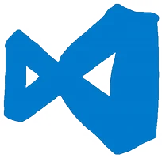
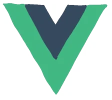
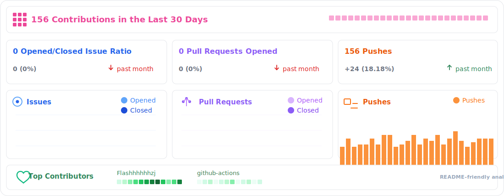

<div align="center">

[;Heidanr+builds+useful+things+step+by+step;USM+computer+science+student;Web+apps%2C+automation%2C+Markdown+workflows&center=true&size=27)](https://git.io/typing-svg)

<picture>
  <source media="(prefers-color-scheme: dark)" srcset="./assets/images/coding.gif" />
  <source media="(prefers-color-scheme: light)" srcset="./assets/images/developer.svg" />
  
</picture>

<div>&nbsp;</div>

<div>
  <a href="https://github.com/Flashhhhhhzj"></a>&emsp;
  <a href="https://www.linkedin.com/in/Flashhhhhhzj/"></a>&emsp;
  <a href="https://instagram.com/zzzzjun_0328"></a>&emsp;
  <a href="mailto:zhangjun@student.usm.my"></a>&emsp;
  
</div>

<picture>
  <source media="(prefers-color-scheme: dark)" srcset="https://raw.githubusercontent.com/Flashhhhhhzj/Flashhhhhhzj/main/profile-snake-contrib/github-contribution-grid-snake-dark.svg" />
  <source media="(prefers-color-scheme: light)" srcset="https://raw.githubusercontent.com/Flashhhhhhzj/Flashhhhhhzj/main/profile-snake-contrib/github-contribution-grid-snake.svg" />
  
</picture>
</div>

<h1 align="center">🙋 Hello</h1>

### 🤺 About Me


<p align="center">嗨，你好，我是 Heidanr，目前在 USM 学习 Computer Science。</p>
<p align="center">我喜欢把课程项目做得不只是“交作业”，而是继续打磨成像样、可展示、可复用的真实作品。</p>
<p align="center">最近主要在折腾前端体验、文档自动化、Markdown 转换、知识库整理，以及 AI 辅助工作流。</p>
<p align="center"><strong>I enjoy turning messy ideas and repetitive tasks into clean, useful workflows.</strong></p>

### 📃 Recent Feed


<!-- feed start -->
- Apr 06 - [Flashhhhhhzj starred yamadashy/repomix](https://github.com/yamadashy/repomix)
- Apr 06 - [Flashhhhhhzj starred citywill/pocket-stack](https://github.com/citywill/pocket-stack)
- Apr 02 - [Flashhhhhhzj pushed Flashhhhhhzj](https://github.com/Flashhhhhhzj/Flashhhhhhzj/compare/944fb3c1c5...28c2f2892c)
- Apr 02 - [Flashhhhhhzj pushed Flashhhhhhzj](https://github.com/Flashhhhhhzj/Flashhhhhhzj/compare/2350cc9a72...944fb3c1c5)
- Apr 02 - [Flashhhhhhzj pushed Flashhhhhhzj](https://github.com/Flashhhhhhzj/Flashhhhhhzj/compare/289130c29e...2350cc9a72)
<!-- feed end -->

### 📊 WakaTime

**I'm a Night 🦉**

```text
🌞 Morning                118 sessions        ████░░░░░░░░░░░░░░░░░░░░░   18.15 %
🌆 Daytime                176 sessions        ███████░░░░░░░░░░░░░░░░░░   27.08 %
🌃 Evening                164 sessions        ██████░░░░░░░░░░░░░░░░░░░   25.23 %
🌙 Night                  192 sessions        ████████░░░░░░░░░░░░░░░░░   29.54 %
```

📅 **I'm Most Productive On Friday**

```text
Monday                   82 sessions         ███░░░░░░░░░░░░░░░░░░░░░░   12.62 %
Tuesday                  88 sessions         ███░░░░░░░░░░░░░░░░░░░░░░   13.54 %
Wednesday                91 sessions         ███░░░░░░░░░░░░░░░░░░░░░░   14.00 %
Thursday                 95 sessions         ████░░░░░░░░░░░░░░░░░░░░░   14.62 %
Friday                   116 sessions        █████░░░░░░░░░░░░░░░░░░░░   17.85 %
Saturday                 84 sessions         ███░░░░░░░░░░░░░░░░░░░░░░   12.92 %
Sunday                   94 sessions         ████░░░░░░░░░░░░░░░░░░░░░   14.46 %
```

📊 **This Week I Spent My Time On**

```text
🕑 Time Zone: Asia/Shanghai

💬 Programming Languages:
TypeScript               5 hrs 42 mins       ████████████░░░░░░░░░░░░░   47.9 %
JavaScript               2 hrs 31 mins       █████░░░░░░░░░░░░░░░░░░░░   21.2 %
Markdown                 1 hr 46 mins        ████░░░░░░░░░░░░░░░░░░░░░   14.9 %
Python                   1 hr 12 mins        ███░░░░░░░░░░░░░░░░░░░░░░   10.1 %
Other                    43 mins             ██░░░░░░░░░░░░░░░░░░░░░░░    5.9 %

🔥 Editors:
VS Code                  9 hrs 58 mins       █████████████████████░░░░   83.6 %
Cursor                   1 hr 57 mins        ████░░░░░░░░░░░░░░░░░░░░░   16.4 %

💻 Operating System:
macOS                    11 hrs 55 mins      █████████████████████████   100.0 %
```

<div align="center">


<table>
  <tr>
    <td>
      <picture>
        <source media="(prefers-color-scheme: dark)" srcset="https://github-readme-activity-graph.vercel.app/graph?username=Flashhhhhhzj&theme=xcode&bg_color=FFFFFF&color=2563eb&line=14b8a6&point=f59e0b&area=true&hide_border=true" />
        <source media="(prefers-color-scheme: light)" srcset="https://github-readme-activity-graph.vercel.app/graph?username=Flashhhhhhzj&theme=xcode&bg_color=FFFFFF&color=2563eb&line=14b8a6&point=f59e0b&area=true&hide_border=true" />
        
      </picture>
    </td>
  </tr>
</table>

</div>

<div align="center">


<br>


<br>







<picture>
  <source media="(prefers-color-scheme: dark)" srcset="https://raw.githubusercontent.com/Flashhhhhhzj/Flashhhhhhzj/main/profile-3d-contrib/profile-night-rainbow.svg" />
  <source media="(prefers-color-scheme: light)" srcset="https://raw.githubusercontent.com/Flashhhhhhzj/Flashhhhhhzj/main/profile-3d-contrib/profile-gitblock.svg" />
  
</picture>

<br><br>



</div>


