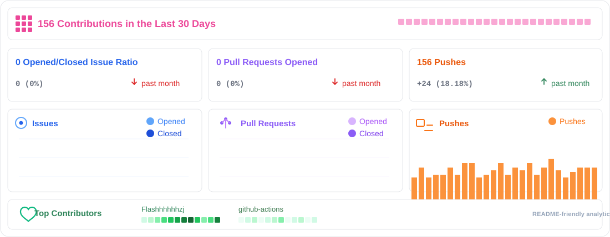

[;Heidanr+builds+useful+things+step+by+step;USM+computer+science+student;Web+apps%2C+automation%2C+Markdown+workflows&center=true&size=27)](https://git.io/typing-svg)

<picture>
  <source media="(prefers-color-scheme: dark)" srcset="./assets/images/coding.gif" />
  <source media="(prefers-color-scheme: light)" srcset="./assets/images/developer.svg" />
  
</picture>

&nbsp;

  &emsp;
  &emsp;
  &emsp;
  &emsp;
  

<picture>
  <source media="(prefers-color-scheme: dark)" srcset="https://raw.githubusercontent.com/Flashhhhhhzj/Flashhhhhhzj/main/profile-snake-contrib/github-contribution-grid-snake-dark.svg" />
  <source media="(prefers-color-scheme: light)" srcset="https://raw.githubusercontent.com/Flashhhhhhzj/Flashhhhhhzj/main/profile-snake-contrib/github-contribution-grid-snake.svg" />
  
</picture>

<h1 align="center">🙋 Hello</h1>

<table>
  <tr>
    <td>
      <picture>
        <source media="(prefers-color-scheme: dark)" srcset="https://github-readme-activity-graph.vercel.app/graph?username=Flashhhhhhzj&theme=xcode&bg_color=FFFFFF&color=2563eb&line=14b8a6&point=f59e0b&area=true&hide_border=true" />
        <source media="(prefers-color-scheme: light)" srcset="https://github-readme-activity-graph.vercel.app/graph?username=Flashhhhhhzj&theme=xcode&bg_color=FFFFFF&color=2563eb&line=14b8a6&point=f59e0b&area=true&hide_border=true" />
        
      </picture>
    </td>
  </tr>
</table>

<picture>
  <source media="(prefers-color-scheme: dark)" srcset="https://raw.githubusercontent.com/Flashhhhhhzj/Flashhhhhhzj/main/profile-3d-contrib/profile-night-rainbow.svg" />
  <source media="(prefers-color-scheme: light)" srcset="https://raw.githubusercontent.com/Flashhhhhhzj/Flashhhhhhzj/main/profile-3d-contrib/profile-gitblock.svg" />
  
</picture>

  

